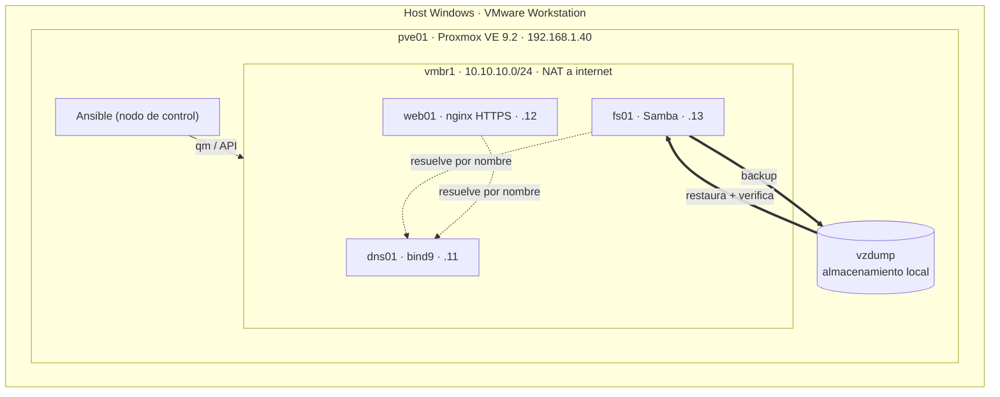
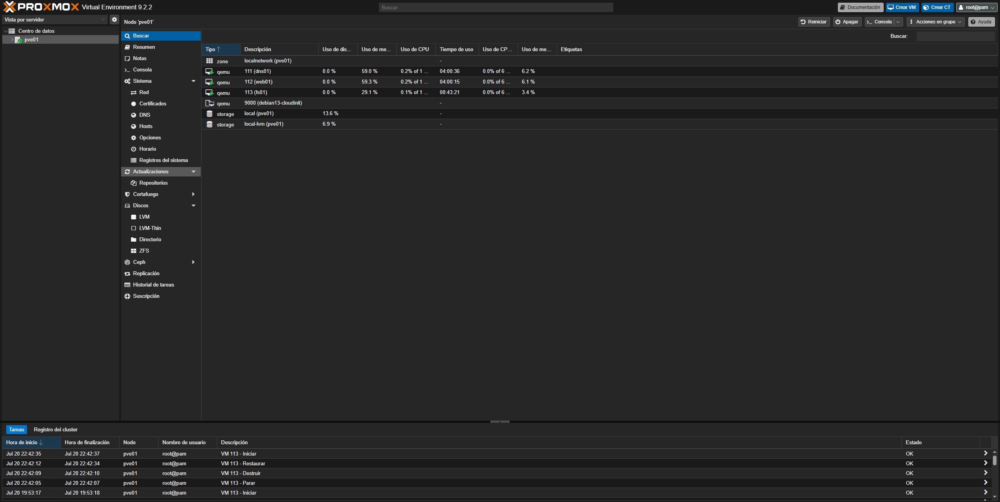
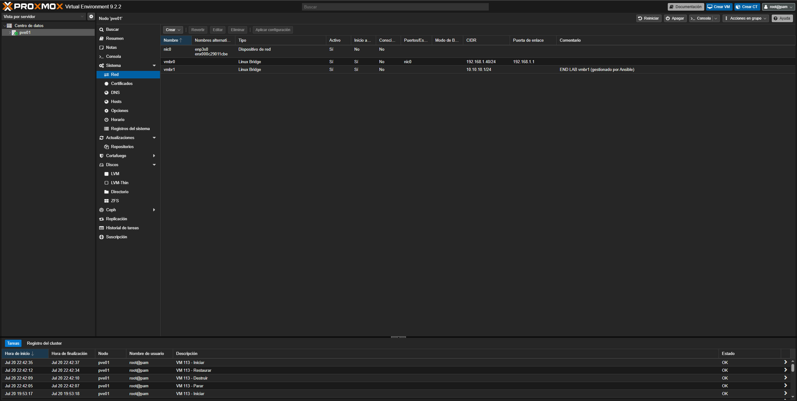
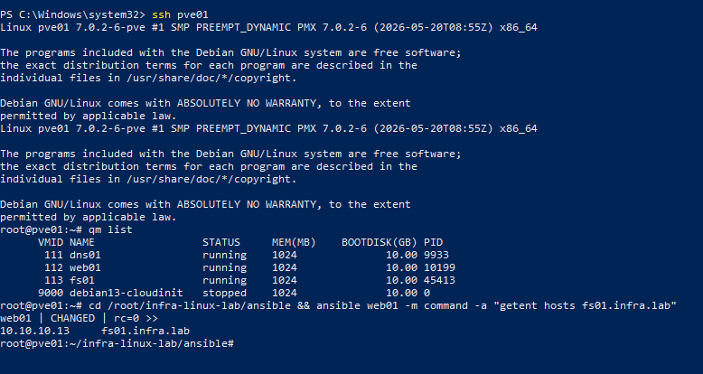
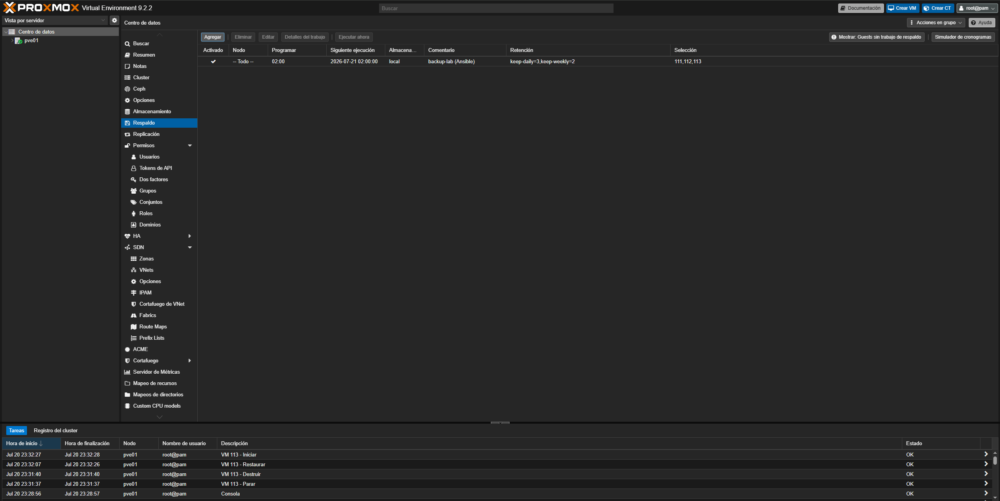
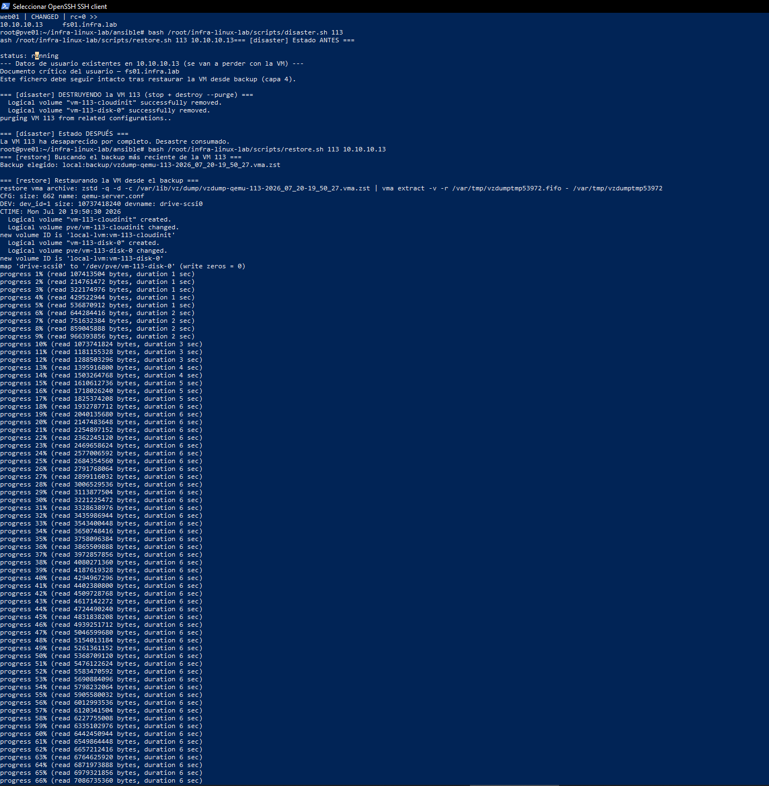
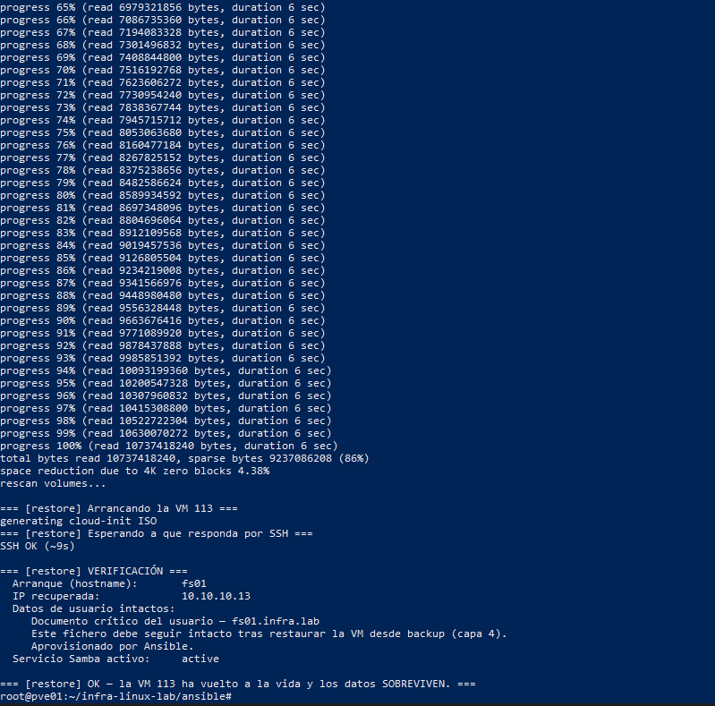
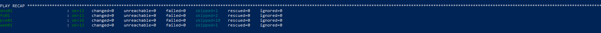

# proxmox-backup-lab

Lab de infraestructura sobre Proxmox VE: Ansible administra el hipervisor,
crea las VMs por código, aprovisiona servicios Linux y los respalda con
`vzdump`. Y lo principal: provoca un desastre y comprueba que los datos
sobreviven a la restauración.

No es "levantar unas VMs con Vagrant". Aquí se administra un hipervisor por su
API y se demuestra un ciclo de backup y restauración de principio a fin.

## Índice

- [El problema](#el-problema)
- [La solución](#la-solución)
- [Arquitectura](#arquitectura)
- [Las capas](#las-capas)
- [El resultado](#el-resultado)
- [Cómo se usa](#cómo-se-usa)
- [Estructura del repo](#estructura-del-repo)
- [Problemas conocidos](#problemas-conocidos)

## El problema

Un portafolio junior típico enseña a instalar servicios, pero casi ninguno
enseña la parte operativa que de verdad importa en producción: qué pasa cuando
una máquina se cae, y cómo se recupera sin perder datos. "Configurar" está
sobrerrepresentado; "respaldar y verificar" no lo está.

## La solución

Un hipervisor Proxmox real gestionado por código, con tres servicios que se
hablan entre sí, backups a nivel de VM completa y un escenario de desastre que
se provoca y se recupera a propósito para comprobar que la recuperación funciona.

Todo el ciclo de vida (red, VMs, servicios, backups) está en Ansible y es
idempotente. La recuperación está en dos scripts y un runbook.

## Arquitectura



La capa de fuera es VMware Workstation, que solo aloja la VM del hipervisor; el
proyecto vive dentro de Proxmox.



*Las tres VMs (`dns01`, `web01`, `fs01`) y la plantilla en Proxmox. Abajo, el
registro de tareas con el ciclo `Parar → Destruir → Restaurar → Iniciar`.*

## Las capas

| Capa | Qué hace | Cómo |
|------|----------|------|
| 0 · Red | Bridge interno aislado con NAT | rol `proxmox_network` |
| 1 · VMs por código | Plantilla cloud-init + clonado de 3 VMs | roles `vm_template`, `vms` |
| 2 · Servicios | DNS interno, web con HTTPS, ficheros | roles `dns`, `web`, `fileserver` |
| 3 · Backups | Job `vzdump` programado con retención | rol `backup` |
| 4 · Desastre y restauración | Destruir una VM y recuperarla verificada | `scripts/disaster.sh`, `scripts/restore.sh` |

La estrella es la capa 4. Las demás existen para que haya algo real que romper
y recuperar.



*Capa 0: el bridge interno `vmbr1` (10.10.10.1/24), creado y gestionado por Ansible.*



*Capas 1-2: las VMs en marcha (`qm list`) y la resolución por nombre vía el DNS interno.*



*Capa 3: el job de `vzdump` diario sobre las tres VMs, con retención.*

## El resultado

Salida real del escenario de desastre sobre el fileserver (`fs01`):

```
DISASTER → fs01 running, con datos → destruida por completo → desaparecida
RESTORE  → backup restaurado → arranca → SSH OK en 12s
           hostname: fs01            ✓
           IP:       10.10.10.13      ✓ recuperada
           datos:    IMPORTANTE.txt   ✓ intactos
           Samba:    active           ✓
```

Una VM borrada y devuelta a la vida con los datos de usuario intactos, todo
comprobado por el propio script:



*`disaster.sh` destruye `fs01` por completo.*



*`restore.sh` la recupera y verifica: arranca, recupera la IP, los datos siguen
intactos y Samba vuelve a estar activo.*

Y todo el ciclo de vida es idempotente. Relanzar el playbook completo no cambia
nada:



Todas las capturas, con su contexto, en [docs/capturas/](docs/capturas/).

## Cómo se usa

Requisitos: un nodo Proxmox VE 9 con Ansible instalado (el propio nodo hace de
control), y un token de API (`group_vars/all/secrets.yml`, ver el `.example`).

```bash
# Montar el lab entero (red, plantilla, VMs, servicios):
cd ansible
ansible-playbook site.yml

# Configurar backups y tomar el primero:
ansible-playbook site.yml --tags backup

# Provocar y recuperar el desastre:
../scripts/disaster.sh 113
../scripts/restore.sh 113 10.10.10.13
```

Se puede lanzar por capas con `--tags network,template,vms,services,backup`.
Los procedimientos de recuperación están en [docs/runbook.md](docs/runbook.md).

## Estructura del repo

```
proxmox-backup-lab/
├── ansible/
│   ├── site.yml              playbook maestro por capas
│   ├── inventory.yml         proxmox (local) + VMs del lab
│   ├── group_vars/all/       variables (qué VMs, qué respaldar) + secrets
│   └── roles/
│       ├── proxmox_network/  vmbr1 + NAT
│       ├── vm_template/       plantilla cloud-init de Debian
│       ├── vms/               clonado de las VMs
│       ├── dns/ web/ fileserver/   servicios
│       └── backup/            vzdump + retención
├── scripts/
│   ├── disaster.sh           provoca la pérdida
│   └── restore.sh            restaura y verifica
└── docs/
    └── runbook.md            procedimientos de recuperación
```

## Problemas conocidos

- **Puente de red de VMware Workstation.** En modo automático puentea por la
  primera tarjeta candidata, que puede no ser la física. Hubo que dejar el
  "VMware Bridge Protocol" activo solo en la NIC real para que Proxmox tuviera
  red. Si un día el nodo pierde conectividad, es lo primero que miro.
- **`group_vars/all/` es un directorio, no un fichero.** Un `group_vars/secrets.yml`
  suelto no se carga (Ansible espera un nombre de grupo). Las variables y los
  secretos van dentro de `group_vars/all/`.
- **DNS de bootstrap.** Las VMs nacen con DNS público (1.1.1.1) para poder
  instalar paquetes, y solo después se les apunta a `dns01`. Si se invierte el
  orden, el `apt` de los servicios falla.
- Certificado de nginx autofirmado: el navegador avisa, es esperado en un lab.
